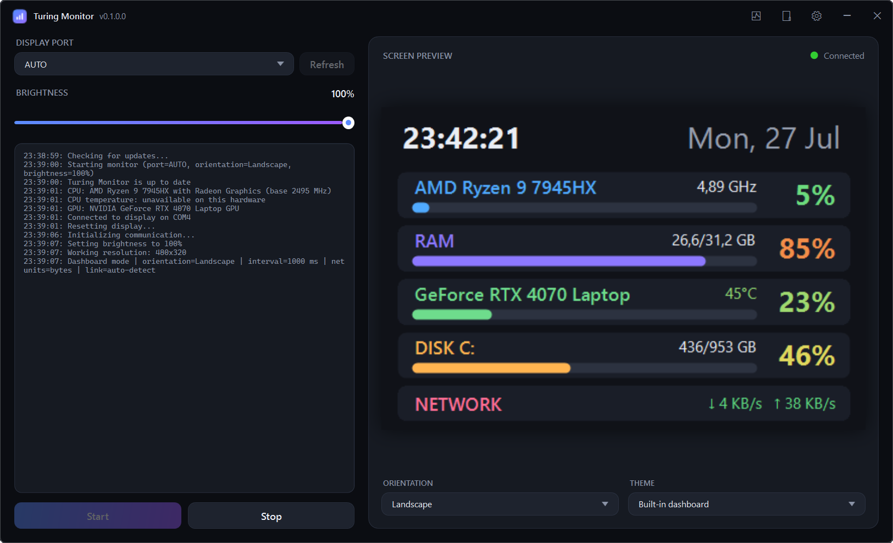
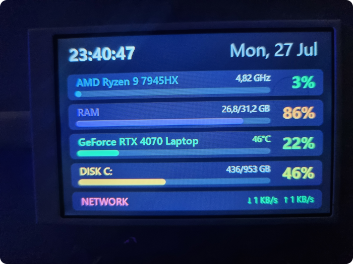

# 🖥️ Turing Monitor

Windows (WPF) application for hardware monitoring on small USB screens of the **Turing Smart Screen** type. Displays CPU/GPU load, RAM, disk, network and clock - either in the built-in dashboard or in one of the themes compatible with the [turing-smart-screen-python](https://github.com/mathoudebine/turing-smart-screen-python) project.

  
  

> [!WARNING]
> **Tested exclusively on a 3.5" IPS "V2" screen** (CH340 chip, `VID_1A86&PID_5722`, identifier `USB35INCHIPSV2`, native resolution 320×480). The application implements only the **Rev A** communication protocol - other hardware variants (Rev B/C/D, WeAct A/B and other screen sizes) **are not supported**, even though `res/themes` contains ready-made themes for larger screens too (5", 8", 8.8", etc.) - those will only display correctly on a screen of the matching physical size.

## Features

- **Dashboard** - built-in, ready-to-use layout with CPU, RAM, GPU, disk and network, no theme selection required.
- **Themes** - support for `theme.yaml` files compatible with turing-smart-screen-python (static images/text, progress bars, radial indicators, dynamic text).
- **Hardware sensors** - CPU (load, clock, temperature), GPU (NVIDIA / AMD / Intel via [LibreHardwareMonitorLib](https://github.com/LibreHardwareMonitor/LibreHardwareMonitor)), RAM, disk, network.
- **Live preview** in the application window + a "Live readings" panel with raw readings.
- **System tray** - minimize to tray, autostart with Windows, automatic reconnect after the screen is disconnected.
- **"Away mode"** - optionally closes the application automatically when no screen is connected or there's no active wired Ethernet connection.
- **Update checking** - optional, queries this repository's GitHub Releases on startup.

## Requirements

- Windows 10 1903+ / Windows 11 (x64)
- .NET 10 Desktop Runtime
- A **Turing Smart Screen 3.5" (Rev A)** connected via USB
- Running as **administrator** is required for CPU temperature readings to work (a limitation of the LibreHardwareMonitor driver) - without elevated rights the application works normally, but this one value stays unavailable

## Themes

The `res/themes` directory contains themes in the format used by the turing-smart-screen-python project. The selection list marks themes with a size other than 320×480 with a ⚠️ icon - those will render incorrectly on a `3.5"` screen.
Some themes also use stat categories (e.g. `UPTIME`, `CUSTOM`, `WEATHER`, `PING`) that the current version of `ThemeEngine` doesn't support yet - the corresponding widgets will stay empty in that case.

## MIT License

Copyright © 2026 [Sefinek](https://sefinek.net)
